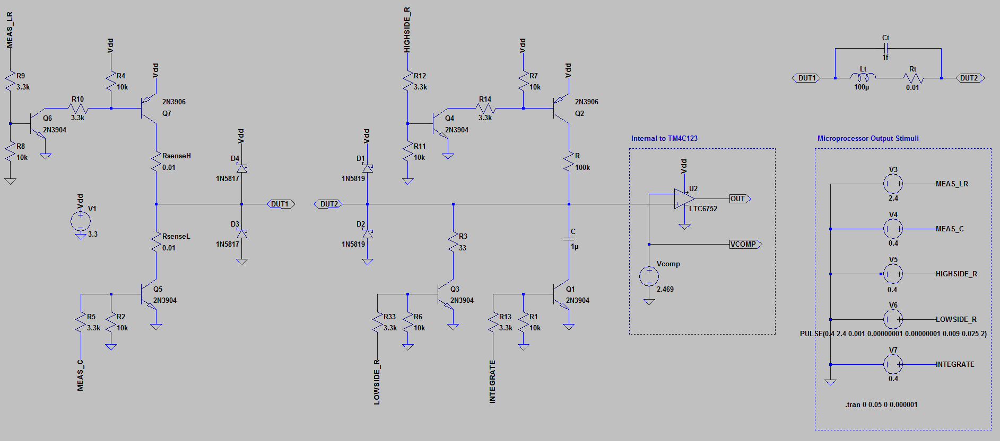

# LCR_Meter
The goal of this project is design a system capable of measuring resistance, inductance (and ESR), and capacitance	The goal of this project is design a system capable of measuring resistance, inductance (and ESR), and capacitance
 The Schematic of the circuit is as shown below:	
 # Schematic	
 
